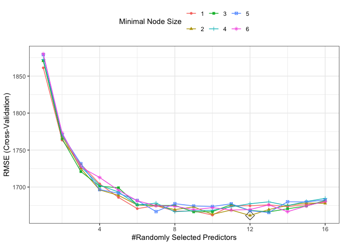
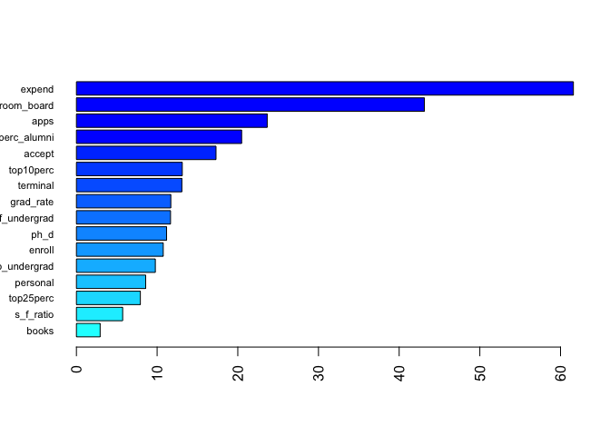

Homework4
================
Yuki Joyama
2024-04-17

``` r
# read csv files 
df = read_csv("./College.csv") |> 
  janitor::clean_names() |> 
  dplyr::select(-college) |> 
  dplyr::select(outstate, everything())

# partition (training:test=80:20)
set.seed(100)
data_split = initial_split(df, prop = .80)
train = training(data_split)
test = testing(data_split)
```

# 1-a Regression Tree

I will build a regression tree on the training data to predict the
response `outstate`.

``` r
set.seed(100)

tree1 <- rpart(
  formula = outstate ~.,
  data = train,
  control = rpart.control(cp = 0)
)

# selecting an optimal cp
cpTable <- tree1$cptable
plotcp(tree1)
```

<!-- -->

Now, I will prune the tree based on the `cp` table.

``` r
# minimum cv error
minErr <- which.min(cpTable[,4])
tree2 <- rpart::prune(tree1, cp = cpTable[minErr, 1])
```

`cp` that gives the minimum cross-validation error is 0.0051853.

The plot of the tree using the above `cp`:

``` r
rpart.plot(tree2)
```

<!-- -->

# 1-b Random Forest

Here I will perform random forest on the training data using `caret` and
\`ranger\`\`.

``` r
# set up cv
ctrl <- trainControl(method = "cv")
rf.grid <- expand.grid(
  mtry = 1:16,
  splitrule = "variance",
  min.node.size = 1:6
)

# tune rf model using the training data
set.seed(100)
rf.fit <- train(
  outstate ~.,
  data = train,
  method = "ranger",
  tuneGrid = rf.grid,
  trControl = ctrl
)

ggplot(rf.fit, highlight = TRUE)
```

<!-- -->

The best tuning parameters are as follows:

``` r
rf.fit$bestTune
```

    ##    mtry splitrule min.node.size
    ## 68   12  variance             2

Now, let’s see the permutation-based variable importance.

``` r
# refit rf model using the best tune
set.seed(100)
rf.final.per <- ranger(
  outstate ~.,
  data = train,
  mtry = rf.fit$bestTune[[1]],
  splitrule = "variance",
  min.node.size = rf.fit$bestTune[[3]],
  importance = "permutation",
  scale.permutation.importance = TRUE
)

barplot(
  sort(ranger::importance(rf.final.per), decreasing = FALSE),
  las = 2, horiz = TRUE, cex.names = 0.7,
  col = colorRampPalette(colors = c("cyan", "blue"))(16)
)
```

<!-- -->

The plot indicates that the `expend` variable has the largest influence
in the model with mean decrease in accuracy 61.6%.

``` r
# test error
# pred.rf <- predict()
```
