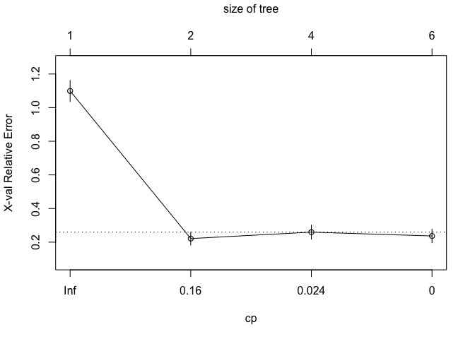

Homework4
================
Yuki Joyama
2024-04-17

``` r
# read csv files 
df = read_csv("./College.csv") |> 
  janitor::clean_names() |> 
  dplyr::select(-college) |> 
  dplyr::select(outstate, everything())

# partition (training:test=80:20)
set.seed(100)
data_split = initial_split(df, prop = .80)
train = training(data_split)
test = testing(data_split)
```

# 1-a Regression Tree

I will build a regression tree on the training data to predict the
response `outstate`.

``` r
set.seed(100)

tree1 <- rpart(
  formula = outstate ~.,
  data = train,
  control = rpart.control(cp = 0)
)

# selecting an optimal cp
cpTable <- tree1$cptable
plotcp(tree1)
```

<!-- -->

Now, I will prune the tree based on the `cp` table.

``` r
# minimum cv error
minErr <- which.min(cpTable[,4])
tree2 <- rpart::prune(tree1, cp = cpTable[minErr, 1])
```

`cp` that gives the minimum cross-validation error is 0.0051853.

The plot of the tree using the above `cp`:

``` r
rpart.plot(tree2)
```

<!-- -->

# 1-b Random Forest

Here I will perform random forest on the training data using `caret` and
\`ranger\`\`.

``` r
# set up cv
ctrl <- trainControl(
  method = "cv", 
  allowParallel = TRUE
)

rf.grid <- expand.grid(
  mtry = 1:16,
  splitrule = "variance",
  min.node.size = 1:6
)

# tune rf model using the training data
set.seed(100)
rf.fit <- train(
  outstate ~.,
  data = train,
  method = "ranger",
  tuneGrid = rf.grid,
  trControl = ctrl
)

ggplot(rf.fit, highlight = TRUE)
```

<!-- -->

The best tuning parameters are as follows:

``` r
rf.fit$bestTune
```

    ##    mtry splitrule min.node.size
    ## 68   12  variance             2

Now, let’s see the permutation-based variable importance.

``` r
set.seed(100)
rf.final.per <- ranger(
  outstate ~.,
  data = train,
  mtry = rf.fit$bestTune[[1]],
  splitrule = "variance",
  min.node.size = rf.fit$bestTune[[3]],
  importance = "permutation",
  scale.permutation.importance = TRUE
)

barplot(
  sort(ranger::importance(rf.final.per), decreasing = FALSE),
  las = 2, horiz = TRUE, cex.names = 0.7,
  col = colorRampPalette(colors = c("cyan", "blue"))(16)
)
```

<!-- -->

The plot indicates that the `expend` variable has the largest influence
in the model with mean decrease in accuracy 61.6%.

``` r
# refit rf model using the best tune
set.seed(100)
rf.final <- ranger(
  outstate ~.,
  data = train,
  mtry = rf.fit$bestTune[[1]],
  min.node.size = rf.fit$bestTune[[3]]
)

# test error
pred.rf <- predict(rf.final, data = test)$predictions
RMSE(pred.rf, test$outstate)
```

    ## [1] 2038.597

The test error is 2038.6.

# 1-c

I will tune the `gbm` model using the training data.

``` r
# set grid
gbm.grid <- expand.grid(
  n.trees = c(5000, 10000, 20000, 30000),
  interaction.depth = 1:4,
  shrinkage = c(0.001, 0.005),
  n.minobsinnode = c(5)
)

set.seed(100)
gbm.fit <- train(
  outstate ~.,
  data = train,
  method = "gbm",
  tuneGrid = gbm.grid,
  trControl = ctrl,
  verbose = FALSE
)

ggplot(gbm.fit, highlight = TRUE)
```

<!-- -->

Best tuning parameters selected by cross validation are as follows:

``` r
gbm.fit$bestTune
```

    ##    n.trees interaction.depth shrinkage n.minobsinnode
    ## 13    5000                 4     0.001              5

``` r
summary(gbm.fit$finalModel, las = 2, cBars = 16, cex.names = 0.6)
```

<!-- -->

    ##                     var    rel.inf
    ## expend           expend 56.9085357
    ## room_board   room_board 11.3344508
    ## apps               apps  4.9572733
    ## terminal       terminal  4.1242516
    ## perc_alumni perc_alumni  3.6933255
    ## ph_d               ph_d  3.6173208
    ## accept           accept  3.2647067
    ## grad_rate     grad_rate  2.7529279
    ## personal       personal  1.8657716
    ## f_undergrad f_undergrad  1.7728646
    ## top25perc     top25perc  1.1460003
    ## top10perc     top10perc  1.0562117
    ## p_undergrad p_undergrad  1.0344284
    ## s_f_ratio     s_f_ratio  0.8681734
    ## books             books  0.8199199
    ## enroll           enroll  0.7838378

Similar to the random forest, we can see that `expand` has the most
influence on the response variable in this model.

``` r
# test error
pred.gbm <- predict(gbm.fit, newdata = test)
RMSE(pred.gbm, test$outstate)
```

    ## [1] 1965.325

The test error is 1965.33.

# 2-a

``` r
# read csv files 
df = read_csv("./auto.csv") |> 
  janitor::clean_names() |> 
  mutate(
    mpg_cat = as.factor(mpg_cat),
    origin = as.factor(origin)
    )

# partition (training:test=70:30)
set.seed(100)
data_split = initial_split(df, prop = .70)
train = training(data_split)
test = testing(data_split)
```

In this section, I will build a classification tree using the training
data with `mpg_cat` as the response.

``` r
set.seed(100)
tree1 <- rpart(
  mpg_cat ~.,
  data = train,
  control = rpart.control(cp = 0)
)

cpTable <- printcp(tree1)
```

    ## 
    ## Classification tree:
    ## rpart(formula = mpg_cat ~ ., data = train, control = rpart.control(cp = 0))
    ## 
    ## Variables actually used in tree construction:
    ## [1] displacement horsepower   weight       year        
    ## 
    ## Root node error: 131/274 = 0.4781
    ## 
    ## n= 274 
    ## 
    ##         CP nsplit rel error  xerror     xstd
    ## 1 0.793893      0   1.00000 1.09924 0.063097
    ## 2 0.030534      1   0.20611 0.22137 0.038872
    ## 3 0.019084      3   0.14504 0.25954 0.041658
    ## 4 0.000000      5   0.10687 0.23664 0.040026

``` r
plotcp(tree1)
```

<!-- -->

``` r
# minimum cv error 
minErr <- which.min(cpTable[,4])
tree2 <- rpart::prune(tree1, cp = cpTable[minErr, 1])
rpart.plot(tree2)
```

<!-- -->

Tree size corresponds to the lowest cv error is two.  
Let’s rerun the classification tree using 1 SE rule.

``` r
# 1 se rule
tree3 <- rpart::prune(
  tree1, cp = cpTable[cpTable[,4] < cpTable[minErr, 4] + cpTable[minErr, 5], 1][1]
)
rpart.plot(tree3)
```

<!-- -->

The tree size is the same.

# 2-b

Here I will perform boosting on the training data.

``` r
# set up cv
ctrl <- trainControl(
  method = "cv", 
  classProbs = TRUE,
  summaryFunction = twoClassSummary,
  allowParallel = TRUE
)

# set grid
xgb.grid <- expand.grid(
  nrounds = seq(from = 200, to = 1000, by = 50),
  max_depth = c(2, 3, 4, 5, 6),
  eta = c(0.025, 0.05, 0.1, 0.3),
  gamma = 0,
  colsample_bytree = 1,
  min_child_weight = 1,
  subsample = 1
)

set.seed(100)
xgb.fit <- train(
  mpg_cat ~.,
  data = train,
  method = "xgbTree",
  tuneGrid = xgb.grid,
  trControl = ctrl,
  verbose = TRUE
)

ggplot(gbm.fit, highlight = TRUE)
```

<!-- -->

Best tuning parameters selected by cross validation are as follows:

``` r
gbm.fit$bestTune
```

    ##    n.trees interaction.depth shrinkage n.minobsinnode
    ## 13    5000                 4     0.001              5

``` r
ggplot(varImp(xgb.fit, scale = FALSE))
```

<!-- -->

The variable importance plot tells us that `displacement` has the most
influence on the response variable in this model.

``` r
# test error
pred.xgb <- predict(xgb.fit, newdata = test, type = "raw")

confusionMatrix(
  data = pred.xgb,
  reference = as.factor(test$mpg_cat)
)
```

    ## Confusion Matrix and Statistics
    ## 
    ##           Reference
    ## Prediction high low
    ##       high   45   2
    ##       low     8  63
    ##                                           
    ##                Accuracy : 0.9153          
    ##                  95% CI : (0.8497, 0.9586)
    ##     No Information Rate : 0.5508          
    ##     P-Value [Acc > NIR] : <2e-16          
    ##                                           
    ##                   Kappa : 0.8269          
    ##                                           
    ##  Mcnemar's Test P-Value : 0.1138          
    ##                                           
    ##             Sensitivity : 0.8491          
    ##             Specificity : 0.9692          
    ##          Pos Pred Value : 0.9574          
    ##          Neg Pred Value : 0.8873          
    ##              Prevalence : 0.4492          
    ##          Detection Rate : 0.3814          
    ##    Detection Prevalence : 0.3983          
    ##       Balanced Accuracy : 0.9091          
    ##                                           
    ##        'Positive' Class : high            
    ## 

The misclassification error rate can be obtained by  
1 - accuracy = 1 - 0.9153 = **0.0847**
